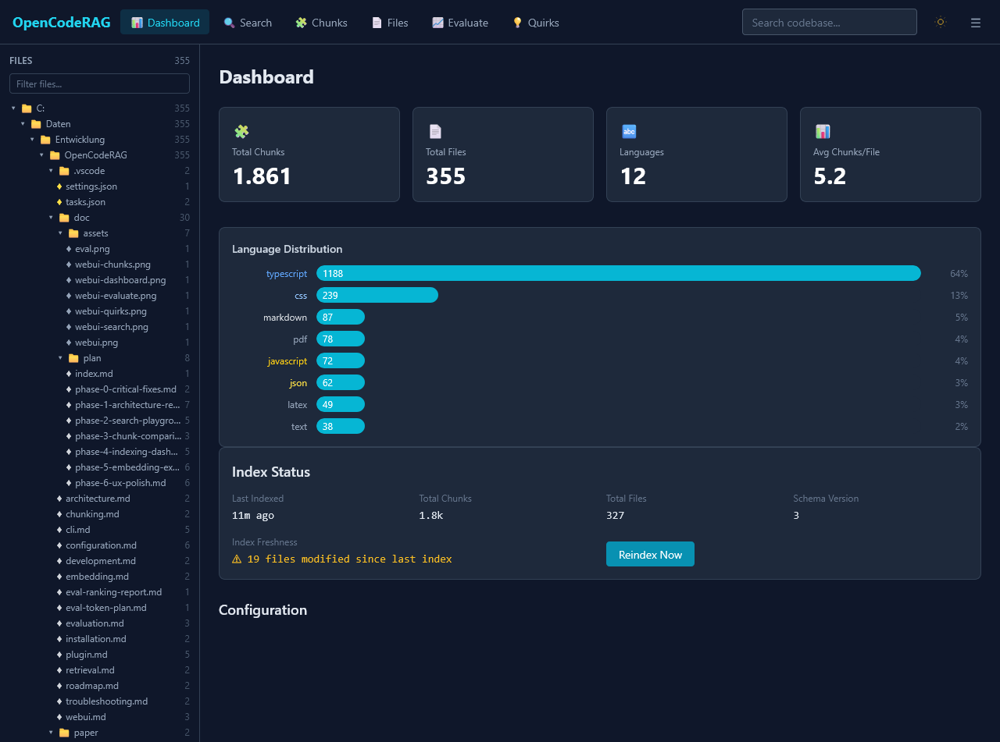
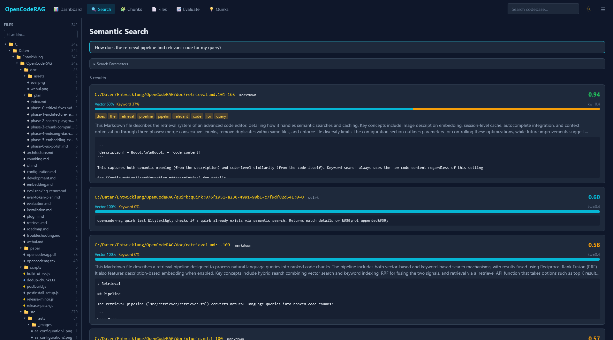
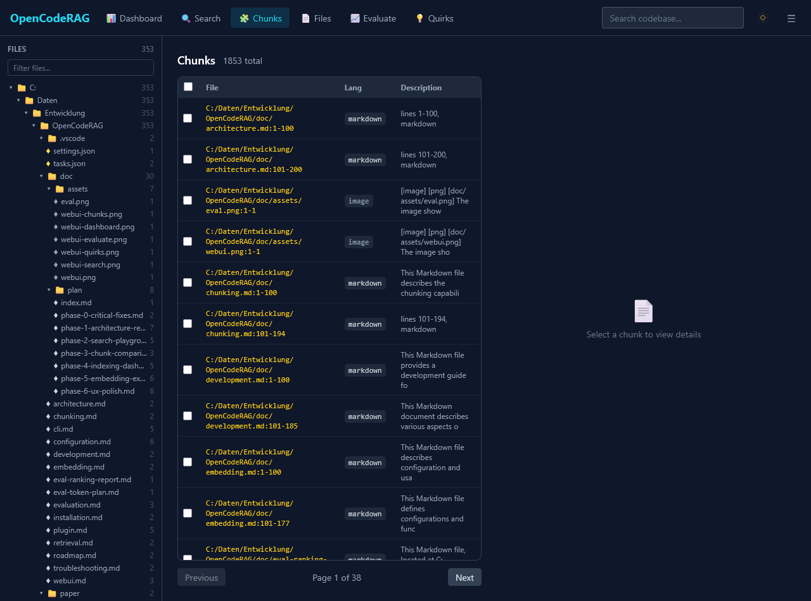
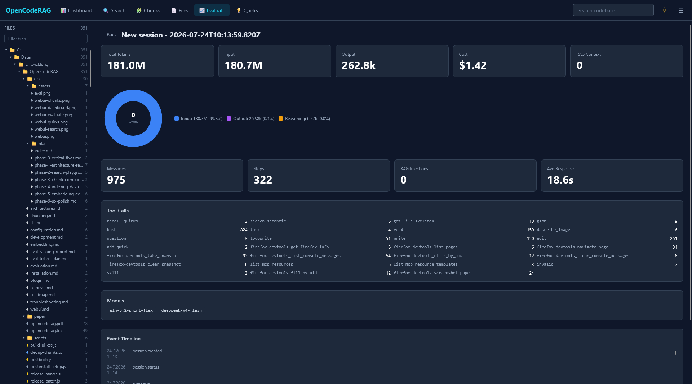
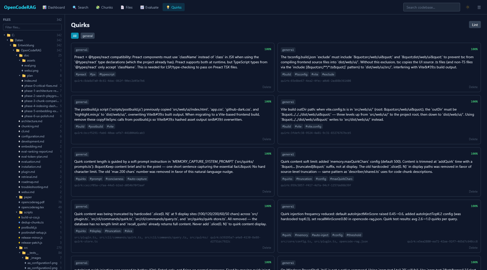

# Web UI

The OpenCodeRAG Web UI is a browser-based dashboard for exploring the indexed vector database and performing semantic code search. It is built with **Preact**, **Vite**, and **Tailwind CSS**, served from a zero-dependency Node.js HTTP server.



## Starting the Web UI

```bash
opencode-rag ui
```

Opens `http://127.0.0.1:3210` in your browser automatically.

**Options:**

| Flag | Default | Description |
|---|---|---|
| `-p, --port <number>` | `3210` | Port to listen on |
| `--no-open` | — | Skip automatic browser launch |
| `-c, --config <path>` | auto-detected | Path to config file |

The server binds to `127.0.0.1` only (localhost). Press `Ctrl+C` to stop.

## Configuration

```json
{
  "ui": {
    "port": 3210,
    "openBrowser": true
  }
}
```

| Option | Default | Description |
|---|---|---|
| `port` | `3210` | HTTP server port |
| `openBrowser` | `true` | Open browser on start |

## Views

### Dashboard

The default view. Shows four KPI cards:

- **Total Chunks** — number of indexed chunks
- **Total Files** — number of indexed files
- **Languages** — number of distinct languages
- **Avg Chunks/File** — mean chunks per file

Below the cards, a **Language Distribution** bar chart displays the top 8 languages by chunk count, with percentage labels.

### Search

The semantic search playground for interactively querying the vector database.



**Query input:** Type a natural language query (e.g., "How does the retrieval pipeline find relevant code for my query?"). The search runs automatically with a 300ms debounce.

**Search Parameters** (collapsible panel):

| Parameter | Default | Description |
|---|---|---|
| `topK` | 10 | Maximum number of results |
| `minScore` | 0.35 | Minimum relevance threshold |
| `keywordWeight` | 0.4 | Hybrid search fusion weight (0 = vector only, 1 = keyword only) |
| Hybrid mode | on | Toggle hybrid vector+keyword search on/off |

**Result cards** show for each match:

- **File path** and **line range** (yellow, monospace)
- **Relevance score** (color-coded: green ≥0.8, cyan ≥0.6, amber ≥0.4, red <0.4)
- **ScoreBar** — stacked horizontal bar showing **vector contribution** (cyan) vs **keyword contribution** (amber), with precise values on hover
- **Matched terms** — query tokens found in the chunk, shown as amber chips
- **Description** — LLM-generated chunk summary (if enabled)
- **Code snippet** — truncated source code preview

Shareable URLs: search parameters are encoded in the URL hash.
Example: `#/search?query=auth+middleware&topK=15&minScore=0.5`

**Keyboard shortcut:** `Ctrl/Cmd+K` opens the Search view from anywhere.

### Chunks

A master-detail split pane for browsing individual chunks.



**Left pane (master):** Paginated table with columns:

| Column | Description |
|---|---|
| File | File path + line range (e.g. `src/plugin.ts:10-42`) |
| Lang | Language badge (color-coded) |
| Description | Truncated chunk description |

Click a row to view its details. Use **Previous** / **Next** to paginate.

**Right pane (detail):** Shows the selected chunk:

- File path, line range, language badge, chunk ID
- **Description** card (LLM-generated or path-based)
- **Image Preview** panel (for image chunks) — displays the actual image file with automatic loading from the workspace
- **Source Code** / **Vision Analysis** panel with a **Copy** button (shows the vision provider's text description for image chunks)

Active filters (language, file) appear as dismissible badges above the table.

### Files

A table of all indexed files with:

| Column | Description |
|---|---|
| File | Full file path |
| Lang | Language badge |
| Chunks | Number of chunks for that file |

Click a file row to navigate to the Chunks view filtered by that file.

### Evaluate

Session analytics dashboard for tracking token usage, costs, and RAG performance across OpenCode conversations.



**Session List:** A table of all recorded sessions with columns:

| Column | Description |
|---|---|
| checkbox | Select for comparison |
| Session | Session title or ID |
| Last Activity | Timestamp of last event |
| Messages | Total message count |
| Input Tokens | Input + cache read tokens |
| Output Tokens | Output tokens generated |
| Cost | Estimated API cost |
| RAG Calls | Number of RAG context injections |
| RAG Tokens | Tokens used for RAG context |
| Model | Primary model used |

**Actions:**
- Click a row to view session details
- Select 2 sessions via checkboxes and click **Compare Selected** for side-by-side comparison
- Click the trash icon to delete a session

**Session Detail:** Expanded view showing:

- **KPI Cards:** Total Tokens, Input Tokens, Output Tokens, Cost, RAG Context Tokens
- **Metrics:** Messages, Steps, RAG Injections, Avg Response time
- **Tool Calls:** Breakdown of tool usage (bash, read, edit, webfetch, grep, glob, task, search_semantic, question)
- **Models Used:** List of models active in the session
- **Token Analysis:** RAG savings projection, per-query breakdown with RAG context/chunk/score per query
- **Event Timeline:** Chronological log of session events with timestamps

**Token Analysis (per session):** Automatically computed for each session detail view:

- **Savings Projection:** Estimated tokens with vs without RAG, net savings, and percentage
- **RAG Overhead:** Context tokens injected + system guidance tokens
- **Per-Query Breakdown:** Table showing input/output tokens, RAG context, chunk count, top score, and read/RAG tool calls per query. RAG-injected queries highlighted with cyan border.

**Comparison (enhanced):** When comparing 2 sessions:

- **Verdict Banner:** Prominent banner showing whether RAG saves or costs tokens (green/red)
- **Delta Table:** All metrics with delta and percentage change columns
- **Savings Projection:** Side-by-side savings estimate for both sessions

**What-If Projection Panel:** Interactive sliders in the Evaluate view for projecting token savings:

- **Sliders:** Avg chunk size, chunks per query, reads per query (with/without RAG), query count
- **Live Output:** RAG overhead tokens, saved read tokens, net savings, and verdict
- Fires debounced API calls on slider changes

For CLI-based session analysis (`eval:sessions`, `eval:analyze`, `eval:compare`), see [Evaluation documentation](evaluation.md).

### Quirks

Quirk memory management — gotchas, preferences, decisions, and environment constraints discovered during coding sessions.



- **Card grid** (1 col → 2 cols at `lg`) displaying each quirk with:
  - Color-coded type badge (gotcha = amber, preference = emerald, decision = sky, environment-constraint = rose)
  - Confidence percentage (color-coded: green > 70%, amber > 40%, red below)
  - Content text
  - Tags as `#tag` chips
  - Source reference and ID
- **Type filter pills** — filter by quirk type
- **Lint button** — health-check quirks (low confidence, stale, duplicates)
- **Delete** — remove a quirk with confirmation

## File Tree Sidebar

A collapsible directory tree in the left sidebar:

- Directories show a file count badge and expand/collapse on click
- Files are color-coded by language
- Active file is highlighted
- **Filter input** at the top narrows the tree by path substring
- Clicking a file navigates to the Chunks view filtered to that file

## Global Search

A quick keyword search input in the top-right header:

- Debounced (300ms) keyword search against the TF×IDF index
- Results appear in a dropdown panel showing file path, line range, language badge, and a code snippet
- Click a result to navigate to that chunk in the Chunks view

## Keyboard Shortcuts

| Shortcut | Action |
|---|---|
| `Ctrl/Cmd+K` | Open Search view (from anywhere) |
| `g + d` | Navigate to Dashboard |
| `g + s` | Navigate to Search |
| `g + c` | Navigate to Chunks |
| `g + f` | Navigate to Files |
| `g + e` | Navigate to Evaluate |
| `g + q` | Navigate to Quirks |

## API Endpoints

The web server exposes a REST API under `/api/`:

| Endpoint | Method | Description |
|---|---|---|
| `/api/stats` | GET | Total chunks, total files, language distribution |
| `/api/files` | GET | All indexed files with metadata |
| `/api/chunks?offset=&limit=&lang=&file=` | GET | Paginated, filtered chunks |
| `/api/chunks/:id` | GET | Single chunk by ID |
| `/api/search?q=&topK=` | GET | Keyword search via KeywordIndex |
| `/api/compare?ids=` | GET | Fetch multiple chunks for side-by-side view |
| `/api/retrieve?q=&topK=&minScore=&keywordWeight=&hybrid=&path=&lang=&explain=` | GET/POST | **Semantic search** — full vector+hybrid retrieval pipeline with score breakdowns and matched terms |
| `/api/eval/sessions` | GET | All recorded sessions with summary stats |
| `/api/eval/sessions/:id` | GET | Single session detail with events |
| `/api/eval/sessions/:id` | DELETE | Delete a recorded session |
| `/api/eval/sessions/:id/analysis` | GET | Token analysis with RAG savings projection and per-query breakdown |
| `/api/eval/token-compare?a=&b=` | GET | Token analysis comparison with verdict, deltas, and percent changes |
| `/api/eval/project-savings` | POST | Project token savings for given chunk/reads parameters (body: JSON) |
| `/api/quirks` | GET | List all quirks |
| `/api/quirks/lint` | GET | Health-check quirks |
| `/api/quirks/:id` | DELETE | Delete a quirk |
| `/api/file?path=` | GET | Serve workspace file content (base64-encoded); used for displaying image files in the chunk detail view |

All endpoints return JSON with `Access-Control-Allow-Origin: *`.

## Tech Stack

| Layer | Choice |
|---|---|
| Frontend framework | **Preact** via Vite |
| Styling | **Tailwind CSS** (PostCSS build pipeline) |
| Syntax highlighting | **highlight.js** |
| Charts | Custom **SVG** components (donut, bar, scatter) |
| State management | **@preact/signals** |
| Routing | **Hash-based** (`#/search?query=...`) |
| Bundle size | **~24 kB gzip** (vendor + app) |
